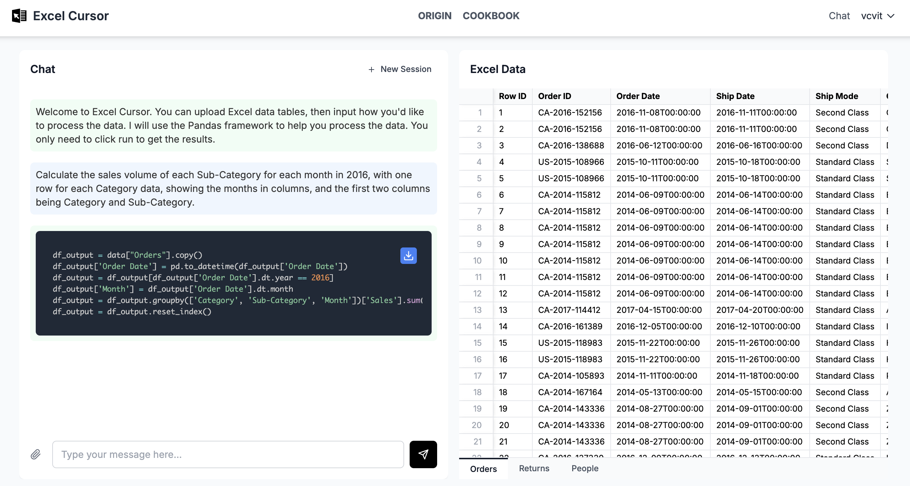
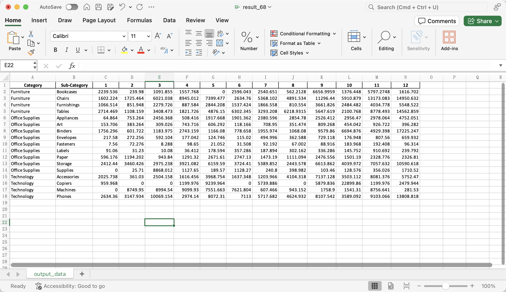

# Monthly Sales Breakdown
Analyze monthly sales by product category

## Sample Data

## Prompt
> Calculate the sales volume of each Sub-Category for each month in 2016, with one row for each Category data, showing the months in columns, and the first two columns being Category and Sub-Category.

## Excel Cursor Response

## Result
