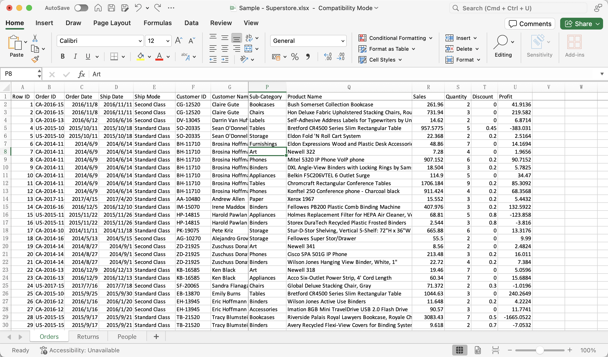

# Multi-table Data Stats
Perform data analysis by linking multiple tables together.

## Sample Data

## Prompt
Match the Order IDs in the Returns table with the ones in the Orders table, count how many returns each customer made, and list their ID and name.

## Excel Cursor Response

## Result
