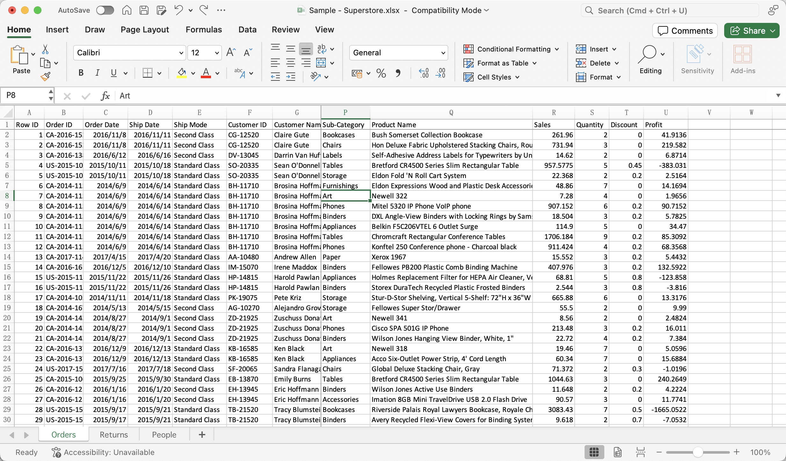
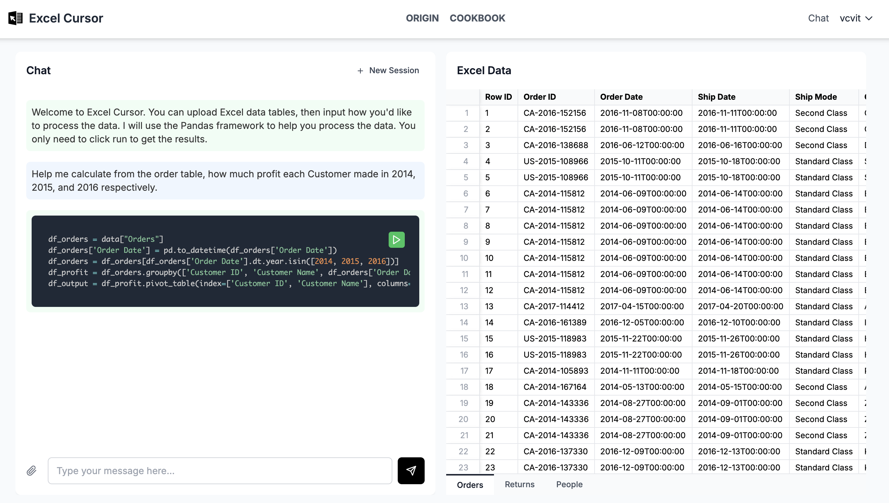
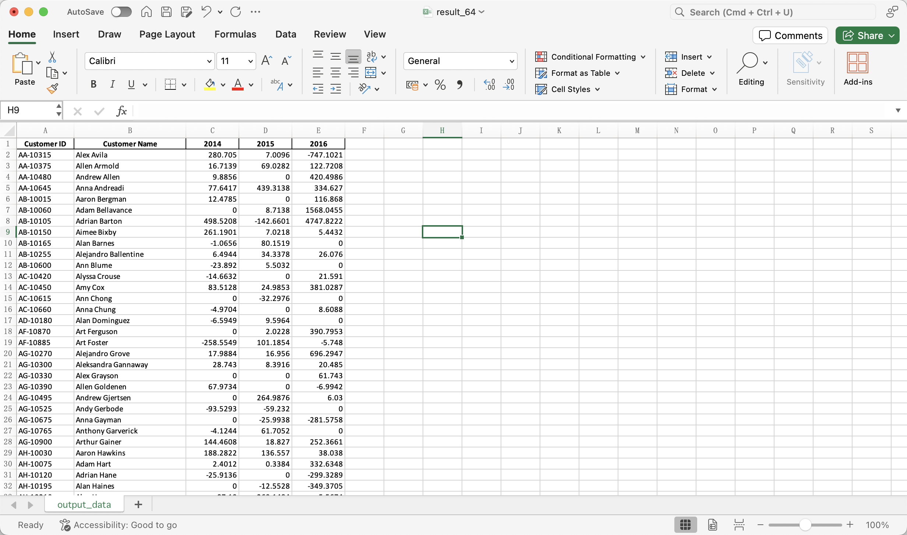

``# Order Profit Statistics
Calculate the total profit amount for each year based on order data.

## Sample Data

## Prompt
Help me calculate from the order table, how much profit each Customer made in 2014, 2015, and 2016 respectively.

## Excel Cursor Response

## Result
